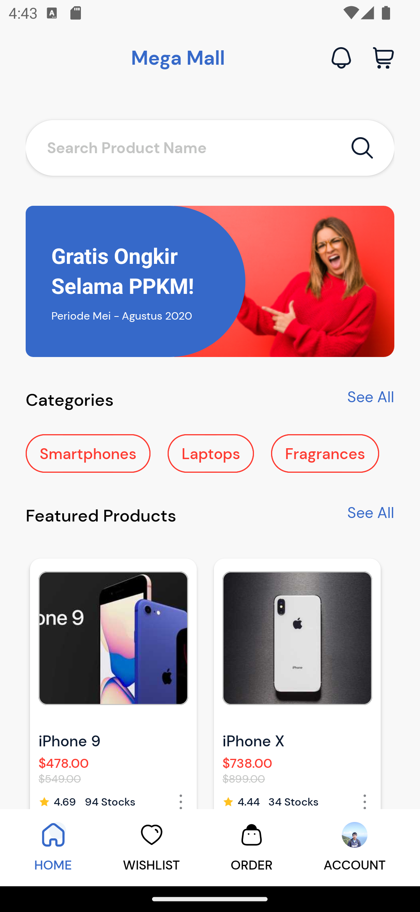

# React Native E-Commerce App

### Preview



### Special Credits:

- https://dummyjson.com

#### TODO:

- <del>Display Products section</del>
- <del>News section</del>
- <del>Category section</del>
- <del>View Product page</del>
- <del>Tabbar (Bottom bar)</del>
- Search Page
- Filter by Category page
- Wishlist Page
- Order Page
- View News Page
- Account Page

## Guides:

#### Queries

You can look for queries in

```
./utils/queries/*.queries.ts
```

```ts
import { getAllProducts } from "./utils/queries/product.queries.ts";
const allProducts = await getAllProducts(); // get all products
```

#### Types

You can look for types in

```
./types/*.type.ts
```

```ts
import type { Product } from "./types/product.type.ts";
```
